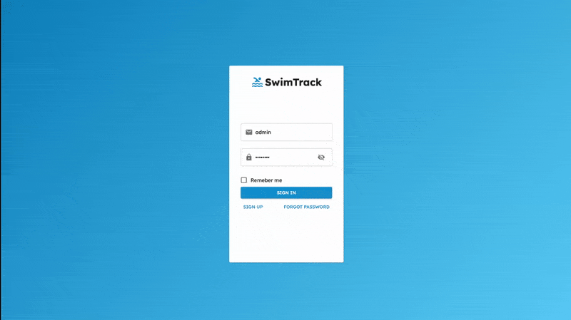

# Swimtrack

**Swimtrack** is a fullstack web application designed to streamline how swim instructors manage and access Lifesaving Society worksheets. It replaces traditional paper-based storage with a fast, searchable digital alternative — making worksheet organization effortless and efficient.

This was my **first major project**, inspired by a real-world problem I faced at work. As instructors, we were still using **physical binders** to store everything — making it nearly impossible to find worksheets when we needed them. **Swimtrack** was built to solve that.

## 🧠 Lessons & Rewrite Decision

After working on **Swimtrack** for several months, I began to feel frustrated with the codebase. As I learned more about best practices and scalable architecture, it became clear that the project had grown in complexity without the structure to support it. The early decisions I made — from folder structure to state management — started to hold me back.

Eventually, I decided to **pause development** and plan a full **rewrite from scratch**. The goal of the rewrite is to apply everything I’ve learned since starting Swimtrack: cleaner code, better separation of concerns, and a more maintainable foundation for future features.

While the current version remains functional, the rewrite represents the next step in my growth as a developer — and a commitment to building things the right way.

[Follow the rewrite here](https://github.com/Dayne-404/swimtrack_v2/tree/main)

## 🚀 Features

- 📂 Create and store worksheets digitally  
- 🔍 Fast and flexible search system  
- 🗂️ Organized and filterable document listing  
- 🧾 Pagination and sorting for large worksheet sets  
- ⚡ Optimized for speed using Vite and React

## 🛠️ Built With

**Frontend:**

- React  
- Vite  
- TypeScript  
- Material UI (MUI)

**Backend:**

- Node.js  
- Express  
- MongoDB  
- Mongoose  
- dotenv  
- cors

## 🧪 Roadmap

- [x] Fix filtering on frontend  
- [x] Fix sorting on backend  
- [x] Better pagination for finder  
- [ ] Move worksheet fetch logic to grid component  
- [ ] Add all swimmer level descriptions  
- [ ] Create a dedicated "Programs" view  
- [ ] Add "Help" view for onboarding  
- [ ] Upgrade the worksheet grid to v2
